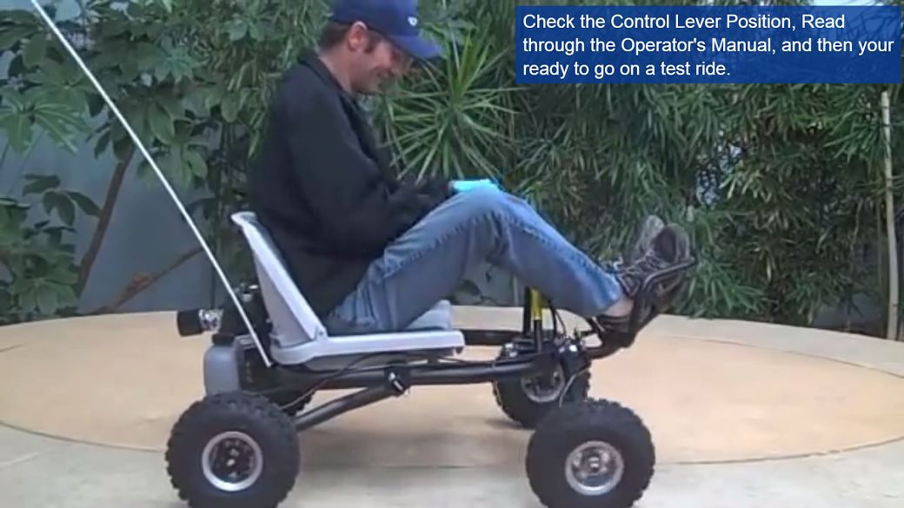

This is somewhat throwaway repo to bootstrap v1 of everything related to OpenGoKart project.

The aim of the project is to have a detailed plan/manual/build instructions for a go-kart. The construction should be simple enough for anyone to build it with some basic tools. The target audience are fathers with children looking to do stuff together.

As much of the tools used to develop the go-kart as possible should be open source. The same holds for all components and sub-assemblies.

I'd be really happy if the more final design resembled 

Once [stackedit supports editing github wikis](https://github.com/benweet/stackedit/issues/1141) I'll move most of the stuff to a wiki.

> Written with [StackEdit](https://stackedit.io/).
<!--stackedit_data:
eyJoaXN0b3J5IjpbLTEwODk0NDI0NzRdfQ==
-->